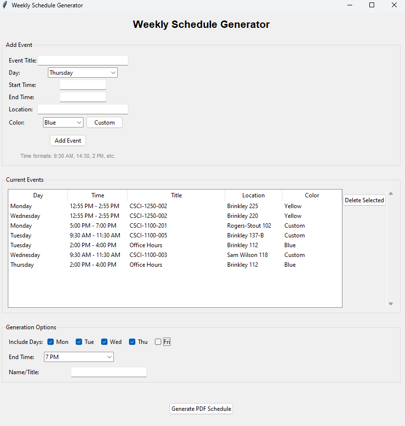
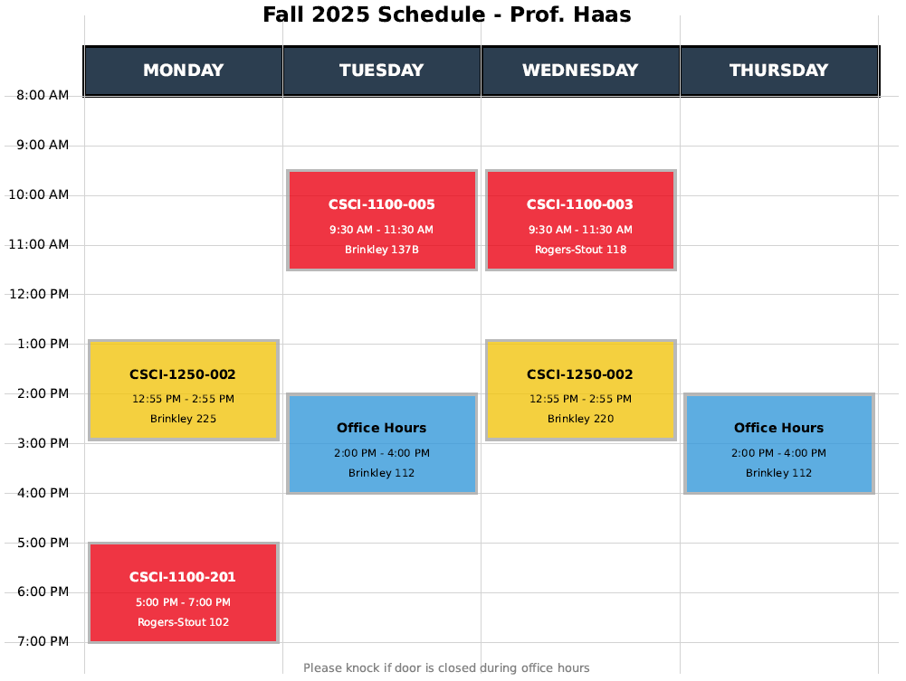

# Weekly Schedule Generator

A simple desktop application designed for professors and academic staff to create professional-looking weekly schedule PDFs for office hours, classes, and meetings.

  

## Example Preview

  

## Features

- **Easy Event Entry**: Add events with title, day, time range, location, and color
- **Flexible Time Formats**: Supports various time inputs (12-hour AM/PM, 24-hour, with or without minutes)
- **Color-Coded Events**: Choose from preset colors or select custom colors
- **Professional PDF Output**: Generates clean, printable schedules in landscape format
- **Customizable Options**: Select which days to include and set end times
- **User-Friendly Interface**: Simple point-and-click operation with no technical expertise required

## Quick Start

### Download and Run
**Windows Download**: [schedule_generator.exe](./dist/schedule_generator.exe) (44 MB)
**MacOS Download**: [schedule_generator.zip](./dist/schedule_generator.zip) (43 MB)

- For MacOS, use the Archive Utility to decompress the ZIP file.
- Move the executable to your Desktop or somewhere convenient.
- It is slow to load on Mac. Too bad :/

- **No Installation Required**: The application runs directly from the executable (or it just crashes, idk)

*Note: Windows may show a security warning for downloaded executables. Click "More info" then "Run anyway" if prompted.*

## How to Use

### Adding Events
1. **Event Title**: Enter the name of your class, meeting, or office hours
2. **Day**: Select from Monday through Friday
3. **Start/End Time**: Enter times in any of these formats:
   - `9:30 AM` or `2:15 PM` (12-hour format)
   - `09:30` or `14:15` (24-hour format)
   - `9 AM` or `2 PM` (hour only)
4. **Location**: Add room number or building (optional)
5. **Color**: Choose a preset color or select "Custom" for your own color
6. Click **Add Event**

### Managing Events
- **View Events**: All added events appear in the list below the entry form
- **Delete Events**: Select an event from the list and click "Delete Selected"
- **Edit Events**: Delete and re-add events to make changes

### Generating Your Schedule
1. **Select Days**: Check which days to include in your schedule (Monday-Friday)
2. **Set End Time**: Choose when your schedule should end (6 PM - 11 PM)
3. **Add Your Name**: Enter your name or title for the schedule header
4. Click **Generate PDF Schedule**
5. Choose where to save your PDF file

## Example Time Formats

The application accepts various time formats for your convenience:

| Format | Example | Notes |
|--------|---------|-------|
| 12-hour with minutes | `9:30 AM`, `2:15 PM` | Standard format |
| 12-hour without minutes | `9 AM`, `2 PM` | For hour-only times |
| 24-hour with minutes | `09:30`, `14:15` | Military/international time |
| 24-hour without minutes | `9`, `14` | Simple hour format |

## Tips for Professors

- **Office Hours**: Use consistent colors for office hours vs. classes
- **Recurring Events**: Add the same event multiple times for different days
- **Room Numbers**: Include building abbreviations (e.g., "CS 301", "Library 2A")
- **Break Times**: Add lunch or break blocks to show availability
- **Print Quality**: PDFs are optimized for both screen viewing and printing

## PDF Output Features

- **Professional Layout**: Clean, easy-to-read schedule format
- **Landscape Orientation**: Maximizes space for event details
- **Time Grid**: Clear hourly divisions from 8 AM to your selected end time
- **Color-Coded Events**: Each event displays in your chosen color
- **Header Information**: Includes semester and your name/title
- **Footer Note**: Automatically adds "Please knock if door is closed during office hours"

## Technical Requirements

- **Operating System**: Windows 10 or later or MacOS 15.6.1 or later
- **Dependencies**: None (all required components are bundled)
- **File Size**: 43 KB
- **Python Version**: Built with Python 3.12.6

## Troubleshooting

**Q: The application won't start**
- Try right-clicking and selecting "Run as administrator"
- Windows: Check that Windows Defender isn't blocking the file
- MacOS: Idk man

**Q: Time format error**
- Use the examples above as a guide
- Make sure start time is before end time
- Avoid special characters in time entries

**Q: PDF won't generate**
- Ensure you have at least one event added
- Check that you have write permissions to the save location
- Try saving to your desktop or Documents folder

**Q: Colors don't appear correctly**
- Custom colors require clicking "Custom" and selecting from the color picker
- Preset colors should work automatically

